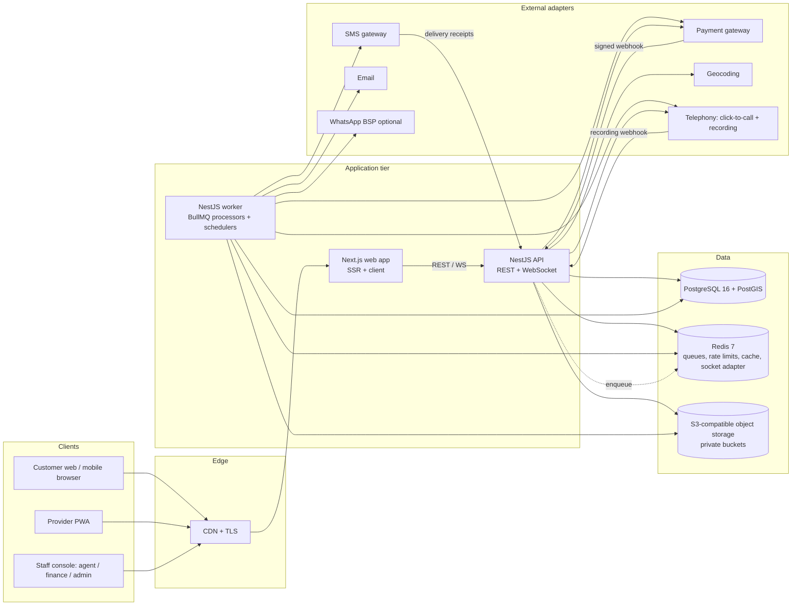

# Technical Requirements & Design Document (TRD) — Smart Home Maintenance Services

| Field | Detail |
|---|---|
| Version | 1.0 |
| Implements | `01_SRS_v2.1.md` |
| Data model | `03_ERD.md`, `04_schema.sql` |
| Audience | Engineers, reviewers, QA, DevOps, and the AI coding agent (Cursor) |

This document is the engineering contract. Where the SRS says *what*, this says *how*, and records why each choice was made (§24 Decision Log). Where the two disagree, the SRS wins and this document must be corrected.

---

## 1. Architecture Overview



**Style:** modular monolith. One deployable API and one worker built from the **same codebase**, each domain module owning its tables. Modules talk through application services and domain events, never through each other's repositories. This keeps the system simple to run for a single team while leaving clean seams to extract services later.

**Three non-negotiable cores** (everything else is conventional CRUD):
1. **Booking state machine** — the only writer of `bookings.status` (§5).
2. **Ledger** — the only writer of money (§6).
3. **Verification engine** — the only path to release (§9).

---

## 2. Technology Stack

| Layer | Choice | Why |
|---|---|---|
| Language | TypeScript 5 (strict) everywhere | One language, shared types/schemas between web and API. |
| Monorepo | pnpm workspaces + Turborepo | Fast, cached builds; shared packages. |
| Web | Next.js 15 (App Router), React 19 | SSR for public/SEO pages, client components for dashboards. |
| UI | Tailwind CSS 4 + shadcn/ui + lucide icons | Accessible primitives, RTL-friendly with logical properties. |
| Forms / validation | react-hook-form + zod (shared schemas) | Same schema validates client and server. |
| Data fetching | TanStack Query 5 | Caching, retries, optimistic updates. |
| i18n | next-intl (en, ur; `dir="rtl"` for ur) | |
| PWA | Serwist (service worker) + IndexedDB (idb-keyval) | Offline evidence queue for providers on 3G. |
| API | NestJS 11 on Fastify | Modules, DI, guards, interceptors — fits a modular monolith. |
| Validation (API) | nestjs-zod using `packages/contracts` | Single source of truth for DTOs; OpenAPI generated. |
| ORM / migrations | Prisma 6 as the **client only** (`prisma db pull` → `generate`) + **dbmate** for plain-SQL migrations | Prisma for typed queries; SQL migrations for what Prisma can't express (exclusion constraints, partial indexes, triggers, PostGIS). Never run `prisma migrate`. |
| DB | PostgreSQL 16 + PostGIS 3 + `btree_gist`, `pgcrypto`, `citext` | Transactions, exclusion constraints, geo queries. |
| Queue / scheduler | BullMQ 5 on Redis 7 | Delayed jobs (timeouts), repeatable jobs (sweeps), retries. |
| Realtime | Socket.IO via `@nestjs/websockets` + Redis adapter | Offer countdowns, queue updates, chat. |
| Object storage | S3 API (MinIO locally; AWS S3 / Cloudflare R2 prod) | Presigned uploads; private by default. |
| Auth | Own implementation: Argon2id, JWT access (15 min) + rotating refresh token (httpOnly cookie), TOTP for staff | No third-party identity lock-in; phone-first OTP fits the market. |
| PDFs / Excel | `pdfmake`, `exceljs` | No headless browser needed in the worker. |
| Logging / errors | Pino (JSON) + Sentry | |
| Testing | Vitest (unit), Jest-compatible Supertest + Testcontainers (integration), Playwright (E2E), k6 (load) | |
| CI/CD | GitHub Actions → Docker images → registry → deploy | |
| Runtime | Node.js 22 LTS, Docker | |

---

## 3. Repository Layout

```
smart-home/
├─ apps/
│  ├─ web/                    # Next.js
│  │  ├─ app/[locale]/(public)/...      # home, services, provider profile, auth
│  │  ├─ app/[locale]/c/...             # customer area
│  │  ├─ app/[locale]/p/...             # provider area (PWA scope)
│  │  ├─ app/[locale]/agent/...         # verification console
│  │  ├─ app/[locale]/finance/...
│  │  ├─ app/[locale]/admin/...
│  │  ├─ components/ lib/ messages/{en,ur}.json
│  │  └─ public/manifest.webmanifest
│  └─ api/                    # NestJS — two entrypoints
│     ├─ src/main.ts          # HTTP + WS server
│     ├─ src/worker.ts        # BullMQ processors + repeatable schedulers
│     ├─ src/modules/
│     │  ├─ identity/ catalogue/ places/ customers/ providers/
│     │  ├─ search/ bookings/ execution/ verification/
│     │  ├─ ledger/ payments/ payouts/ ratings/ complaints/
│     │  ├─ conduct/ notifications/ plans/ reports/ admin/ audit/ settings/
│     │  └─ integrations/{payment,sms,email,maps,telephony,whatsapp,storage}/
│     ├─ src/common/          # guards, interceptors, errors, outbox, idempotency, clock
│     └─ test/                # integration tests (Testcontainers)
├─ packages/
│  ├─ contracts/              # zod schemas, DTOs, enums, error codes (shared)
│  ├─ domain/                 # PURE logic: state machine, tier routing, pricing,
│  │                          # ranking score, demerit math, SLA calendar — no I/O
│  ├─ db/                     # prisma/schema.prisma, migrations/, seed/
│  ├─ ui/                     # shared React components
│  └─ config/                 # eslint, tsconfig, tailwind presets
├─ e2e/                       # Playwright
├─ infra/ docker-compose.yml, Dockerfiles, k6/
└─ docs/                      # these documents
```

**Rule:** `packages/domain` has zero dependencies on Nest, Prisma or Node APIs. All business rules that can be expressed as pure functions live there and are unit-tested exhaustively. Services in `apps/api` orchestrate: load → call domain → persist → emit.

---

## 4. Backend Module Map

| Nest module | SRS module | Owns tables (see ERD) | Key services |
|---|---|---|---|
| identity | M2/M3/M12 | users, roles, permissions, role_permissions, user_roles, sessions, otp_codes | AuthService, OtpService, SessionService |
| catalogue | M1 | categories, services, service_checklist_items, commission_rules | CatalogueService, PricingService |
| places | — | cities, areas, addresses | GeocodeService |
| customers | M2 | customers, favourites | |
| providers | M3 | providers, provider_documents, provider_services, provider_service_areas, provider_availability, provider_time_off, provider_payout_accounts | ApprovalService, AvailabilityService (slot generator) |
| search | M4 | (read models) | SearchService, RankingService |
| bookings | M5 | bookings, booking_offers, booking_status_history, booking_attachments, messages | BookingStateService, OfferService, SlotLockService |
| execution | M6 | job_evidence, job_checklist_results, quote_revisions, booking_items, invoices | EvidenceService, InvoiceService, GeofenceService |
| verification | M7 | verification_calls, verification_call_attempts, verification_links, verification_amendments, staff_conflicts | TierRouter, QueueService, ConsoleService, AutoReleaseService |
| ledger | M8 | ledger_accounts, ledger_transactions, ledger_entries, account_balances | LedgerService (post), BalanceService |
| payments | M8 | payments, payment_events, refunds, coupons, coupon_redemptions | PaymentService, WebhookService, RefundService |
| payouts | M8 | payout_batches, payouts | PayoutService |
| ratings | M9 | ratings, remarks, remark_replies, provider_stats | RatingService, ReputationProjector |
| complaints | M10 | complaints, complaint_events, disputes | ComplaintService, DisputeService |
| conduct | M15 | breach_types, penalties, demerit_awards, threshold_events, appeals, provider_flags | ConductService, DecayJob |
| notifications | M11 | notifications, notification_templates, outbox_events | Dispatcher, TemplateRenderer |
| plans | M13 | plans, plan_services, subscriptions, plan_visits | PlanScheduler |
| reports | M14 | report_runs | ReportService |
| admin/settings/audit | M12 | settings, audit_log | SettingsService (cached), AuditService |

---

## 5. Booking State Machine

### 5.1 Definition (packages/domain)
```ts
export type BookingEvent =
  | 'checkout_online' | 'checkout_cash' | 'payment_captured' | 'payment_timeout'
  | 'offer_declined' | 'offer_expired' | 'offers_exhausted' | 'accept' | 'confirm_schedule'
  | 'cancel_by_customer' | 'cancel_by_provider' | 'reschedule' | 'depart'
  | 'start_work' | 'report_no_show' | 'raise_revision' | 'approve_revision' | 'reject_revision'
  | 'complete' | 'enqueue_verification' | 'outcome_verified' | 'link_confirmed'
  | 'outcome_rework' | 'outcome_disputed' | 'auto_release' | 'rework_window_expired'
  | 'release' | 'resolve_release' | 'resolve_partial' | 'resolve_refund'
  | 'warranty_claim' | 'close';

export interface TransitionRule {
  from: BookingStatus[]; event: BookingEvent; to: BookingStatus;
  actors: ActorRole[];                       // CUSTOMER | PROVIDER | AGENT | FINANCE | ADMIN | SYSTEM
  guard?: (ctx: TransitionContext) => GuardResult;   // pure; returns {ok} | {ok:false, code}
}
export const TRANSITIONS: TransitionRule[] = [ /* exactly T1–T26 from SRS §6.2 */ ];
export function nextState(current, event, ctx): { to } | { error } { /* pure */ }
```
Transitions `ACCEPTED → SCHEDULED` and `WORK_COMPLETED → AWAITING_VERIFICATION` are *chained*: the service applies the follow-up system event in the same DB transaction, producing two history rows.

### 5.2 Execution (apps/api `BookingStateService.apply`)
```
BEGIN
  SELECT * FROM bookings WHERE id=$1 FOR UPDATE           -- serialise per booking
  result = domain.nextState(booking.status, event, ctx)    -- pure guard evaluation
  if error → ROLLBACK, throw 409 ILLEGAL_TRANSITION / 422 GUARD_FAILED(code)
  UPDATE bookings SET status=$to, version=version+1, ...side fields
  INSERT booking_status_history(...)
  run effect handlers registered for (from,to)             -- same txn: ledger posts, holds
  INSERT outbox_events(type='booking.transitioned', payload)
COMMIT
```
- **No other code path may `UPDATE bookings SET status`.** Enforce with a lint rule (`no-restricted-syntax` on `status:` in Prisma `booking.update` outside this service) and a DB trigger that rejects a status change unless `current_setting('app.transition_ctx', true) = 'on'` (set by the service via `SET LOCAL`).
- Effects that call external systems (SMS, gateway refunds) are **never** executed inside the transaction; they are outbox events processed by the worker.

### 5.3 Transactional outbox
`outbox_events(id, aggregate, aggregate_id, type, payload, created_at, processed_at, attempts, last_error)`. Worker polls every 1 s with `SELECT … FOR UPDATE SKIP LOCKED LIMIT 100`, dispatches to BullMQ queues (`notifications`, `payments`, `verification`, `projections`), marks processed. Handlers must be idempotent keyed by `outbox_events.id`.

### 5.4 Idempotency
- Mutating endpoints accept `Idempotency-Key` header (required on checkout, payment, payout, refund, complete, verification submit). Stored in `idempotency_keys(key, user_id, route, request_hash, response, created_at)`; replays return the stored response; same key with different body → 422.
- Gateway webhooks deduplicated by `payment_events(provider, provider_event_id)` UNIQUE.

---

## 6. Ledger & Money

### 6.1 Principles
- Amounts are `BIGINT` paisa. Never floats. Helper `Money` type in `packages/domain`.
- Journal model: `ledger_transactions` (one business event) → `ledger_entries` (≥ 2 lines). A deferred constraint trigger asserts Σ(debit) = Σ(credit) per transaction at commit.
- Entries are insert-only. Corrections are reversing transactions (`reverses_transaction_id`).
- `account_balances` is maintained **only** by trigger on `ledger_entries` insert (no app writes; `REVOKE UPDATE` from app role except trigger function `SECURITY DEFINER`). Satisfies "derived, never editable" while keeping reads O(1). A nightly job recomputes from entries and alerts on drift.
- `LedgerService.post(txType, lines[], {bookingId, idempotencyKey})` is the only writer. It validates balance before insert.

### 6.2 Chart of accounts
| Account type | Owner | Normal side | Meaning |
|---|---|---|---|
| `GATEWAY_CLEARING` | platform | debit (asset) | Cash at/with the gateway |
| `ESCROW` | platform (dimension: booking) | credit (liability) | Customer money held for a booking |
| `PROVIDER_WALLET` | provider | credit (liability) | Owed to provider; negative = provider debt |
| `PLATFORM_COMMISSION` | platform | credit (revenue) | Commission earned |
| `PENALTY_INCOME` | platform | credit (revenue) | Fines retained |
| `CUSTOMER_COMPENSATION` | platform | debit (expense) | Goodwill/penalty pass-through to customer |
| `PROMO_EXPENSE` | platform | debit (expense) | Coupons/referral credits |
| `CUSTOMER_RECEIVABLE` | customer | debit (asset) | Unpaid cancellation fees (cash customers) |
| `PLAN_DEFERRED` | platform (dimension: subscription) | credit (liability) | Prepaid plan money not yet earned |
| `PAYOUT_CLEARING` | platform | credit | Payouts in flight to banks |

### 6.3 Posting recipes (D = debit, C = credit)
| Event | Lines |
|---|---|
| Online capture (checkout / top-up) | D `GATEWAY_CLEARING` a · C `ESCROW[b]` a |
| Release (online, amount f, commission k, coupon d) | D `ESCROW[b]` (f−d) · D `PROMO_EXPENSE` d · C `PROVIDER_WALLET[p]` (f−k) · C `PLATFORM_COMMISSION` (k−d)… *if k < d the shortfall is promo expense; provider always receives f−k* |
| Excess escrow refund at release (e = escrow − (f−d)) | D `ESCROW[b]` e · C `GATEWAY_CLEARING` e (+ gateway refund call) |
| Full/partial refund | D `ESCROW[b]` r · C `GATEWAY_CLEARING` r |
| Cash settlement (commission k) | D `PROVIDER_WALLET[p]` k · C `PLATFORM_COMMISSION` k |
| Late-cancel fee, online | D `ESCROW[b]` fee · C `PLATFORM_COMMISSION` fee; remaining escrow refunded |
| Late-cancel fee, cash | D `CUSTOMER_RECEIVABLE[c]` fee · C `PLATFORM_COMMISSION` fee |
| Penalty fine | D `PROVIDER_WALLET[p]` x · C `PENALTY_INCOME` x (or C `CUSTOMER_COMPENSATION` settlement when passed to customer) |
| Payout request approved | D `PROVIDER_WALLET[p]` a · C `PAYOUT_CLEARING` a |
| Payout confirmed paid | D `PAYOUT_CLEARING` a · C `GATEWAY_CLEARING` a |
| Provider pays debt online | D `GATEWAY_CLEARING` a · C `PROVIDER_WALLET[p]` a |
| Plan purchase | D `GATEWAY_CLEARING` a · C `PLAN_DEFERRED[s]` a |
| Plan visit release | D `PLAN_DEFERRED[s]` share · C `PROVIDER_WALLET[p]` (share−k) · C `PLATFORM_COMMISSION` k |

Commission `k = round_half_up(f × rate)` with the rate **snapshotted on the booking at checkout** (`commission_rate_bp`, basis points).

### 6.4 Derived views
- `v_provider_earnings`: held (Σ escrow of provider's bookings in pre-release states, provider share), releasable (wallet balance), paid (Σ payouts PAID), commission (Σ commission lines).
- Wallet balance < 0 and |balance| > `cash.debt_ceiling` → `providers.offer_blocked_reason = 'DEBT'` (set by projector, read by search/offer engine).

### 6.5 Payment flow (online)
1. `POST /bookings/checkout` (Idempotency-Key) → booking `PENDING_PAYMENT`, `payments` row `INITIATED`, gateway session created via adapter → returns `redirectUrl`/`clientToken`.
2. Gateway → `POST /webhooks/payments/:provider` → verify HMAC signature + timestamp tolerance (5 min) → insert `payment_events` (unique) → if new and `CAPTURED`: ledger capture + state `payment_captured` — **one DB transaction**.
3. Browser return URL only polls status; it never changes state.
4. `payment_timeout` delayed BullMQ job fires at `BR-05`; no-op if already captured.

---

## 7. Scheduling & Slot Locking

- **Availability model:** weekly rules (`provider_availability`: weekday, start, end), exceptions (`provider_time_off`: tstzrange), and bookings. Slot generator (pure, in `domain`) produces slots of `service.expected_duration_min` rounded up to 30 min, plus `BR-08` travel buffer, in Asia/Karachi, for 14 days ahead.
- **Double-booking protection (database-level):**
```sql
ALTER TABLE bookings ADD CONSTRAINT no_provider_overlap
  EXCLUDE USING gist (provider_id WITH =, slot WITH &&)
  WHERE (status IN ('PENDING_PAYMENT','REQUESTED','ACCEPTED','SCHEDULED','EN_ROUTE','IN_PROGRESS','QUOTE_REVISION'));
```
`slot` is a `tstzrange` including the travel buffer. `PENDING_PAYMENT` is included in the constraint's status set, so an unpaid online checkout holds the slot until the `payments.timeout` job moves it to `ABANDONED` (≤ `BR-05` minutes); no separate holds table is needed. Insert conflict (`23P01`) → API returns `409 SLOT_TAKEN`, UI refreshes availability (UC-05 7b).
- **Auto-assign:** `provider_id` null, `requested_slot` set; `OfferService` queries ranked providers free for that slot and sends offers sequentially (one active offer at a time) via delayed jobs of `BR-01` minutes.

---

## 8. Search & Ranking

```sql
-- candidate set (parameterised)
SELECT p.id, ps.price_paisa,
       ST_Distance(p.base_location, a.location) AS distance_m,
       st.score, st.completion_rate, st.median_response_sec, st.last_active_at
FROM providers p
JOIN provider_services ps ON ps.provider_id=p.id AND ps.service_id=$service AND ps.status='APPROVED'
JOIN provider_stats st ON st.provider_id=p.id
JOIN addresses a ON a.id=$address
WHERE p.status='APPROVED' AND p.offer_blocked_reason IS NULL
  AND ST_DWithin(p.base_location, a.location, p.radius_m)
  AND EXISTS (SELECT 1 FROM provider_service_areas sa WHERE sa.provider_id=p.id AND sa.area_id=a.area_id)
  AND <optional filters>
```
Ranking computed in `domain.rankProviders()` on ≤ 200 candidates:
`score = w_r·norm(rating) + w_d·(1 − min(dist/radius,1)) + w_c·completion + w_s·(1 − min(resp/900s,1)) + w_a·recency_decay(last_active)`, weights from settings (`BR-60`). New providers without ratings get the neutral prior 3.5 (Bayesian: `(Σr + 3.5·5)/(n+5)`) so they aren't buried. Ties broken by provider id for determinism.

`provider_stats` is a projection table updated by the `projections` queue on rating/booking events. Indexes: GiST on `providers.base_location`, `addresses.location`; btree on `(service_id, status)` in `provider_services`; `(city_id)`, `(area_id)`.

---

## 9. Verification Engine

### 9.1 Tier routing (pure function)
```ts
routeTier(input: {
  providerVerifiedJobs: number; finalAmount: Paisa; service: {isHighRisk: boolean};
  anomalies: Anomaly[]; activeDemerits: number; priorConflict: boolean;
  hadRevisions: boolean; paymentMode: 'CASH'|'ONLINE'; rng: () => number; settings: TierSettings
}): { tier: 'A'|'B'; reasons: TierReason[] }
```
Rules R1–R10 (SRS §5.2). `rng` injected for deterministic tests. Reasons persisted on `verification_calls.routing_reasons` (text[]).

### 9.2 Queue
- On `enqueue_verification`: insert `verification_calls(status='QUEUED', tier, priority, sla_due_at)`. `priority = 0` cash, `1` others; `sla_due_at = SlaCalendar.addBusinessMinutes(completedAt, BR-11|BR-12)` (pure; pauses outside 08:00–22:00 PKT).
- **Claim:** `POST /agent/queue/claim` →
```sql
UPDATE verification_calls SET status='LOCKED', locked_by=$agent, locked_at=now()
WHERE id = (SELECT vc.id FROM verification_calls vc
            WHERE vc.status='QUEUED' AND vc.tier='A' AND vc.next_attempt_at <= now()
              AND NOT is_conflicted($agent, vc.booking_id)
            ORDER BY vc.priority, vc.sla_due_at FOR UPDATE SKIP LOCKED LIMIT 1)
RETURNING *;
```
- Lock sweeper returns `LOCKED` items idle > `BR-26` min to `QUEUED`.
- Outside calling hours the claim endpoint returns `423 OUTSIDE_CALLING_HOURS`.

### 9.3 Attempts & fallback
Each call attempt → `verification_call_attempts(result: ANSWERED|NO_ANSWER|BUSY|WRONG_PERSON|SWITCHED_OFF, band, duration, recording_ref)`. After a failed attempt, `next_attempt_at` = start of the next **different** band (or +2 h if same band still has ≥ 2 h and a different band has already been used). After attempt 3 fails (with ≥ 2 distinct bands) → create `verification_links` (hashed token, 6-digit OTP, expires at completion + 72 h), send SMS + WhatsApp via outbox.

### 9.4 Submission
`POST /agent/verifications/:id/submit` (Idempotency-Key) validates the questionnaire (zod), applies guard rules (SRS §5.4), then in one transaction: set questionnaire columns + `outcome` + `submitted_at` + `status='SUBMITTED'` → trigger freezes the row → booking event (`outcome_*`) → if release-permitting & online: ledger release + `release` event; create `ratings` + `remarks` (unless `AUTO_RELEASED`); if `VERIFIED_WITH_ISSUE`: complaint + provider flag. Amendments: `verification_amendments(verification_call_id, field, old, new, reason, admin_id)` — displays overlay the original; outcome amendments go through the dispute path.

### 9.5 Telephony
- **Mode A (click-to-call)**: `TelephonyAdapter.bridgeCall(agentEndpoint, customerPhone, {record:true, callerId: platformNumber})`; recording URL delivered by webhook → stored in private bucket, encrypted (SSE-KMS or app-level AES-GCM), `recording_ref` saved.
- **Mode B (manual dial)**: agent dials from desk phone, console records attempt result and optionally uploads the recording file. Used when OQ-04 is unresolved. Both modes produce identical records.
- Consent line displayed on console with "Consent read" checkbox (required before questionnaire unlocks).

### 9.6 Scheduled verification jobs
Auto-release sweep (every 5 min): `status IN (QUEUED, LOCKED)` and `completed_at + 72h ≤ now()` → system outcome `AUTO_RELEASED`. Tier B escalation (every 5 min): Tier B with no response ≥ 24 h → `tier='A'`, reason `B_ESCALATED`.

---

## 10. Execution & Evidence

- **Start OTP:** 6 digits, generated when booking becomes `SCHEDULED`, shown in customer app (and SMS on the slot day), stored hashed (`argon2` not needed — HMAC-SHA256 with server pepper), valid on slot date ±12 h, 5 tries then 15-min lock.
- **Geofence:** provider app sends `navigator.geolocation` fix with accuracy on start and complete; server computes `ST_Distance` to address; stores `checkin_at`, `checkin_distance_m`, `checkin_accuracy_m`. Anomaly if distance − accuracy > `BR-09`.
- **Uploads:** client compresses (browser-image-compression, ≤ 1600 px, JPEG q0.8), requests `POST /uploads/presign {bookingId, kind}` → presigned PUT (5 min) → PUT to S3 → `POST /evidence {key, kind, clientCapturedAt}`; server stamps `received_at` (authoritative), validates object exists, magic-byte type check, strips EXIF GPS from customer-visible copies via worker. Offline: evidence saved to IndexedDB queue; service worker Background Sync retries; every upload has a client UUID → server upsert by `(booking_id, client_uuid)` prevents duplicates (FR-EX-12).
- **Invoice:** `booking_items` lines (`SERVICE, EXTRA, PART, SURCHARGE, DISCOUNT, VISIT_FEE`) each with `revision_id` (null for original); `invoices` generated at completion (number `SHM-YYYY-NNNNNN`), PDF rendered by worker.

---

## 11. Conduct Engine

- `breach_types` seeded from SRS §8.2 (code, category, points, fine rule).
- `penalties` lifecycle: `PROPOSED` (evidence attached, provider notified, `reply_due_at = +48h`) → `APPLIED` (admin confirms after reply or expiry) → optionally `APPEALED` → `UPHELD` | `REVERSED`. Applying posts demerit award + ledger fine (capped by `min(fine, jobValue + maxFine − alreadyPenalisedForJob)`).
- Threshold evaluator (pure): `evaluate(prevActive, newActive, breach) → consequences[]`, then harsher-wins merge (CL-14). Persist `threshold_events`; apply suspensions via `providers.suspended_until`, blocks via `providers.status='BLOCKED'`.
- Daily job 02:00 PKT: expire awards, apply decay (CL-15), recompute active points, lift expired suspensions, recompute poor-rating flags.

---

## 12. Notifications

- Outbox event → `notifications` queue → `NotificationPlanner` looks up the matrix (event × recipient role → channels) → renders template (`notification_templates` by `event_key, channel, locale`, Handlebars-style variables, whitelisted) → sends via adapter → logs `notifications` row with status `QUEUED → SENT → DELIVERED|FAILED` (delivery receipts via webhook).
- Retries: 5 attempts, exponential backoff (30 s base). SMS falls back to in-app only after final failure; OTP SMS never falls back.
- In-app: row in `notifications` with `channel='IN_APP'` + Socket.IO push to `user:{id}` room.

---

## 13. Background Jobs Catalogue

| Queue / job | Trigger | Action |
|---|---|---|
| `offers.expire` | delayed BR-01 per offer | Expire offer → next offer or `offers_exhausted` |
| `payments.timeout` | delayed BR-05 | `payment_timeout` if still pending |
| `outbox.dispatch` | every 1 s | Outbox → queues |
| `verification.sla-monitor` | every 1 min | Mark breaches, alert admin |
| `verification.lock-sweeper` | every 1 min | Release stale locks |
| `verification.tierb-escalate` | every 5 min | Tier B → A after 24 h |
| `verification.auto-release` | every 5 min | 72 h rule |
| `verification.link-fallback` | on 3rd failed attempt | Send link |
| `rework.expire` | delayed 48 h | `rework_window_expired` |
| `bookings.no-show-open` | delayed slot+30 min | Enable no-show button |
| `bookings.reminders` | delayed slot−2 h / −24 h | Reminders |
| `bookings.close` | daily 03:00 | Close after warranty |
| `conduct.daily` | daily 02:00 | Expiry, decay, suspensions, flags |
| `penalties.reply-due` | delayed 48 h | Mark ready for admin decision |
| `payouts.batch` | weekly (BR-50) | Build batch, CSV, statements |
| `plans.schedule` | daily 01:00 | Create plan visit bookings 7 days ahead |
| `reports.generate` | on demand + 1st of month | PDF/XLSX |
| `recordings.purge` | daily | Retention (BR-55) |
| `ledger.reconcile` | nightly | Recompute balances; alert on drift |
| `notifications.send` | from outbox | Deliver |

All repeatable jobs are registered idempotently at worker boot with fixed `jobId`s. All time math uses an injectable `Clock` (tests use a fake clock).

---

## 14. API Design

### 14.1 Conventions
- REST, JSON, base `/api/v1`. OpenAPI 3.1 generated at `/api/docs` (staff-only in prod).
- Errors: RFC 9457 problem+json `{type, title, status, code, detail, errors[]}`; `code` from `packages/contracts/errors.ts` (e.g. `ILLEGAL_TRANSITION`, `SLOT_TAKEN`, `OTP_INVALID`, `CONFLICT_OF_INTEREST`, `DEBT_BLOCKED`).
- Pagination: cursor-based (`?cursor=&limit=`, max 100). Filtering via explicit query params (no generic query language).
- Money in JSON: integer paisa + `currency: "PKR"`. Times: ISO-8601 UTC; client renders PKT.
- Optimistic concurrency on editable resources: `If-Match: <version>`.

### 14.2 Endpoint catalogue (abridged; all require auth unless marked public)
| Area | Endpoints |
|---|---|
| Auth | `POST /auth/register` (public) · `POST /auth/otp/request` · `POST /auth/otp/verify` · `POST /auth/login` · `POST /auth/refresh` · `POST /auth/logout` · `POST /auth/password/forgot` · `POST /auth/password/reset` · `POST /auth/totp/setup|verify` |
| Catalogue | `GET /categories` (public) · `GET /services?categoryId` (public) · admin CRUD under `/admin/catalogue/*` |
| Customer | `GET/PATCH /me` · `CRUD /me/addresses` · `GET /me/bookings` · `POST/DELETE /me/favourites/:providerId` · `POST /me/deactivate` |
| Provider | `GET/PATCH /provider/me` · `POST /provider/documents` · `PUT /provider/services` · `PUT /provider/areas` · `PUT /provider/availability` · `CRUD /provider/time-off` · `POST /provider/submit` · `GET /provider/offers` · `POST /provider/offers/:id/accept|decline` · `GET /provider/earnings` · `POST /provider/payouts` · `GET /provider/conduct` · `POST /provider/remarks/:id/reply` · `POST /provider/debt/pay` |
| Search | `GET /search/providers?serviceId&addressId&filters…` · `GET /providers/:id` (public) · `GET /providers/:id/slots?serviceId&from&to` |
| Bookings | `POST /bookings/quote` · `POST /bookings/checkout` · `GET /bookings/:id` · `POST /bookings/:id/cancel` · `POST /bookings/:id/reschedule` · `POST /bookings/:id/no-show` · `GET/POST /bookings/:id/messages` · `POST /bookings/:id/warranty-claim` |
| Execution | `POST /bookings/:id/depart` · `POST /bookings/:id/start {otp, geo}` · `POST /uploads/presign` · `POST /bookings/:id/evidence` · `PUT /bookings/:id/checklist` · `POST /bookings/:id/revisions` · `POST /revisions/:id/approve|reject` · `POST /bookings/:id/complete` · `POST /bookings/:id/cash-received` · `GET /bookings/:id/invoice.pdf` |
| Verification (agent) | `GET /agent/queue` · `POST /agent/queue/claim` · `POST /agent/verifications/:id/release-lock` · `POST /agent/verifications/:id/attempts` · `POST /agent/verifications/:id/call` (click-to-call) · `POST /agent/verifications/:id/submit` |
| Verification (public link) | `GET /v/:token` · `POST /v/:token {otp, answers}` |
| Payments | `POST /webhooks/payments/:provider` (public, signed) · `POST /webhooks/telephony/:provider` · `POST /webhooks/sms/:provider` |
| Finance | `GET /finance/escrow` · `GET /finance/refunds` · `POST /finance/refunds` · `GET/POST /finance/payout-batches` · `POST /finance/payout-batches/:id/mark-paid` · `GET /finance/cash-reconciliation` · `GET /finance/debts` · `GET /finance/ledger?account=` |
| Complaints | `POST /complaints` · `GET /complaints/:id` · `POST /complaints/:id/reply` · admin: `GET /admin/complaints` · `POST /admin/complaints/:id/transition` |
| Disputes | `GET /admin/disputes` · `POST /admin/disputes/:id/resolve` |
| Conduct | `POST /admin/penalties` · `POST /admin/penalties/:id/apply` · `POST /provider/penalties/:id/reply` · `POST /provider/penalties/:id/appeal` · `POST /admin/appeals/:id/decide` |
| Admin | `GET /admin/providers?status` · `POST /admin/providers/:id/approve|reject|block|unblock|deactivate` · `POST /admin/documents/:id/verify` · `/admin/customers/*` · `/admin/users/:id/send-reset` · `/admin/roles/*` · `GET/PUT /admin/settings` · `GET /admin/audit` · `GET /admin/ops-board` · `/admin/staff-conflicts/*` · `/admin/remarks/:id/unpublish` · `/admin/templates/*` |
| Plans | `GET /plans` (public) · `POST /plans/:id/subscribe` · `GET /me/subscriptions` · `POST /subscriptions/:id/cancel` · admin CRUD |
| Reports | `POST /admin/reports {type, period, format}` · `GET /admin/reports/:id` |
| Realtime | WS namespaces: `/rt` rooms `user:{id}`, `booking:{id}`, `agent-queue`, `ops-board` |

---

## 15. Frontend

### 15.1 Route map (all under `/[locale]`)
- Public: `/`, `/services/[category]`, `/services/[category]/[service]`, `/providers/[id]`, `/login`, `/register`, `/register/provider`, `/forgot-password`, `/v/[token]` (Tier B link).
- Customer `/c`: `dashboard`, `book/[serviceId]` (address → providers → slot → details → summary → pay), `bookings`, `bookings/[id]` (live status, OTP card, chat, revisions approval, invoice, complaint, warranty), `addresses`, `favourites`, `plans`, `profile`.
- Provider `/p` (PWA): `today`, `offers` (countdown), `jobs/[id]` (depart → OTP → before photos → checklist → revision → after photos → complete → collect cash), `calendar`, `services`, `areas`, `documents`, `earnings`, `payouts`, `ratings`, `conduct`, `profile`.
- Agent `/agent`: `queue`, `console/[verificationId]` (single screen: left booking+invoice+photos, middle provider history & complaints, right questionnaire; shortcuts 1–5 for scores, `C` consent, `Enter` submit), `attempts`.
- Finance `/finance`: `escrow`, `releases`, `refunds`, `payouts`, `cash`, `debts`, `ledger`.
- Admin `/admin`: `ops`, `providers`, `providers/[id]`, `approvals`, `customers`, `catalogue`, `complaints`, `disputes`, `penalties`, `appeals`, `plans`, `reports`, `roles`, `settings`, `templates`, `audit`.

### 15.2 Rules
- Mobile-first, 360 px baseline; Tailwind logical utilities (`ms-`, `pe-`) for RTL.
- Every page lists its required role in a route manifest; middleware redirects, **but server enforces** (NFR-SE-02).
- Provider bundle kept lean: no charting libs, code-split per step, images lazy.
- Accessibility: labelled inputs, visible focus ring, error text under field, `aria-live` for countdowns.
- Status-to-UI mapping lives in one file (`lib/booking-status-ui.ts`) generated from `contracts` enums, so every state has a label, colour, and next-action.

---

## 16. Authentication & Authorisation

- **Customers/providers:** phone + password; OTP at registration and for recovery. **Staff:** email + password + TOTP (mandatory).
- Access JWT (15 min, `sub`, `roles`, `sid`) in memory; refresh token (30 d, rotating, reuse detection revokes the family) in `httpOnly; Secure; SameSite=Lax` cookie scoped to `/api/v1/auth`. Sessions table stores hashed refresh tokens + device info.
- **RBAC + ownership policies** via a `@Policy()` decorator evaluated by a global guard:

| Permission | CUSTOMER | PROVIDER | AGENT | FINANCE | ADMIN |
|---|---|---|---|---|---|
| Own profile / bookings | own | own | — | — | all |
| Search / book | ✔ | — | — | — | — |
| Accept offers, execute jobs | — | own | — | — | — |
| Verification queue & submit | — | — | ✔ (not conflicted) | — | ✔ |
| Recordings playback | — | — | — | ✔ | ✔ |
| Refunds, payouts, ledger | — | — | — | ✔ | read |
| Dispute resolution, penalties | — | — | — | — | ✔ |
| Approvals, blocks, settings, roles | — | — | — | — | ✔ |
| Identity documents | — | own upload | — | — | approving admin only |

- A test enumerates every registered route and asserts it declares a policy (build fails otherwise).

---

## 17. Integration Adapters

Each adapter = TypeScript interface in `integrations/<kind>/<kind>.port.ts` + `mock` + ≥ 1 real implementation selected by env (`PAYMENT_PROVIDER=mock|safepay|…`). Mock adapters are fully functional (mock gateway serves a local "pay" page and fires signed webhooks; mock SMS writes to a dev inbox page `/dev/inbox`; mock telephony simulates answered/no-answer).

```ts
interface PaymentGateway {
  createCheckout(i: {paymentId; amount: Paisa; customer; returnUrl}): Promise<{redirectUrl; providerRef}>;
  refund(i: {providerRef; amount: Paisa; reason; idempotencyKey}): Promise<{refundRef; status}>;
  verifyWebhook(headers, rawBody): ParsedPaymentEvent;   // throws on bad signature
}
interface SmsSender { send(to: E164, body: string, meta): Promise<{providerMessageId}> }
interface Telephony { bridgeCall(i): Promise<{callRef}>; parseWebhook(h, body): CallEvent }
interface Geocoder { geocode(text, cityHint): Promise<{lat; lng; confidence}> }
interface ObjectStorage { presignPut(key, contentType, maxBytes); presignGet(key, ttl); head(key); delete(key) }
```
Candidate vendors (confirm per OQ-03/04): payments — Safepay, PayFast, JazzCash, Easypaisa; SMS — local aggregator or Twilio; maps — Google Maps Platform or OpenStreetMap/Nominatim + Leaflet; telephony — any provider supporting outbound bridging + recording to PK numbers; WhatsApp — a Meta BSP.

---

## 18. Security & Privacy Implementation
- Helmet headers, strict CSP (nonce-based), HSTS; CORS allow-list = web origin only.
- Rate limiting in Redis (`@nestjs/throttler` with Redis storage) on auth/OTP/search/public link.
- Input validation on every DTO (zod); output DTOs whitelist fields (no entity leakage — e.g. customer phone is never in a provider-facing DTO).
- Webhooks: HMAC verify on raw body, timestamp tolerance, replay dedupe.
- Uploads: presigned with `content-length-range`; post-upload magic-byte check; private buckets; signed GET TTL 5 min; ID documents in a separate bucket with access audited.
- PII redaction in logs (`pino.redact`: phone, email, cnic, otp, password, tokens, address).
- Encryption: TLS in transit; DB volume encryption at rest; CNIC numbers stored AES-256-GCM (app-level, key from KMS/env) + HMAC blind index for uniqueness; recordings encrypted.
- Account deactivation anonymiser job replaces PII with tokens, keeps FKs.
- DB roles: `app_rw` (no DELETE on protected tables, no UPDATE on insert-only tables), `app_migrator`, `app_readonly` (reports).

---

## 19. Observability & Operations
- Structured logs with `requestId`, `userId`, `bookingId`; OpenTelemetry traces optional (OTLP).
- Metrics (Prometheus endpoint): queue depth per queue, verification SLA breaches, offer acceptance latency, webhook failures, ledger drift, notification failure rate.
- Health: `/health/live`, `/health/ready` (DB, Redis, storage).
- Alerts: SLA breach rate > 10 %/h, ledger drift ≠ 0, webhook signature failures spike, queue stalled > 5 min.
- Runbooks in `docs/runbooks/` for: webhook replay, stuck booking, ledger drift, payout batch failure.

---

## 20. Testing Strategy

| Level | Scope | Tooling | Must include |
|---|---|---|---|
| Unit | `packages/domain` | Vitest | Every transition T1–T26 legal + every illegal pair rejected (generated matrix); tier rules R1–R10; SLA calendar edge cases (21:50, midnight, 07:59); demerit decay/expiry time-travel; ranking determinism; commission rounding; money helpers |
| Property | domain | fast-check | Random event sequences never produce illegal states; ledger postings always balance; balance = Σ entries |
| Integration | API + real Postgres/Redis | Testcontainers + Supertest | Exclusion constraint race (50 concurrent checkouts → 1 wins); webhook replay ×10 → one capture; insert-only triggers; rating without verification rejected; RBAC matrix per route |
| Contract | adapters | Vitest | Mock and real adapters satisfy same port tests (real ones in sandbox, nightly) |
| E2E | full stack, mock adapters | Playwright | Happy path online; happy path cash; rework → dispute → partial refund; unreachable → link → auto-release; penalty → reply → appeal reversed; provider debt block; Urdu RTL smoke; 360 px viewport |
| Load | search, queue claim | k6 | 10 000 providers seeded; search p95 < 800 ms at 50 rps |
| Security | | OWASP ZAP baseline in CI, `pnpm audit`, secret scanning | |

Test data: `packages/db/seed` builds a deterministic demo city (Lahore: 20 areas), 6 categories, ~45 services with checklists, 50 providers, 100 customers, staff accounts per role, and bookings in every state (for UI review).

Definition of Done per story: AC from SRS automated; lint/typecheck clean; migrations reversible or forward-fix documented; audit entries for privileged actions; i18n keys in en + ur; screenshots at 360 px and desktop.

---

## 21. Environments, CI/CD, Deployment
- **Local:** `docker compose up` → postgres(postgis), redis, minio, mailpit; `pnpm dev` runs web+api+worker; `pnpm db:reset` migrates + seeds.
- **CI (GitHub Actions):** install → lint → typecheck → unit → integration (services: postgis, redis) → build → E2E (compose) → Docker build & push on `main`.
- **Environments:** dev (auto on main), staging (tag `v*-rc`), production (manual approval). Each with its own DB, bucket, secrets.
- **Hosting (launch-scale recommendation):** containers on a managed platform (e.g. Render/Fly/Railway or a single VPS with Docker + Caddy), managed Postgres with PITR, managed Redis, S3/R2. Scale web/API horizontally; run **exactly one** scheduler instance (BullMQ repeatables are safe with multiple workers, but keep one for simplicity).
- Migrations run as a release step before new pods receive traffic; expand/contract pattern for breaking changes.
- Config: `.env` validated by zod at boot (fail fast); business settings live in DB (`settings`) cached in Redis with pub/sub invalidation.

---

## 22. Performance & Capacity
- Launch target: 1 city, ≤ 1 000 jobs/day, ≤ 10 000 providers, ≤ 50 concurrent staff.
- Search: GiST + candidate cap 200, ranking in memory; cache category/service lists 5 min.
- Verification console: single aggregated endpoint `GET /agent/verifications/:id/context` (one round trip, ≤ 300 ms).
- Images served through CDN with signed URLs and thumbnail variants generated by worker (`sharp`).
- Connection pooling: PgBouncer (transaction mode) — avoid session-level features except `SET LOCAL` inside transactions.

---

## 23. Delivery Plan

| Phase | Duration (1–2 devs) | Scope | Exit criteria |
|---|---|---|---|
| 0 Foundation | 1 wk | Monorepo, CI, compose, `04_schema.sql` migrated, Prisma pulled, auth + RBAC skeleton, settings, audit, adapters (mocks), i18n shell | CI green; login works for all roles; seed runs |
| 1 Onboarding | 2 wks | Catalogue, customer & provider profiles, documents, areas, availability, approval flow, blocking, soft delete | Admin approves a provider who then appears in search |
| 2 Transacting | 3 wks | Search/ranking, slots, checkout (cash + mock online), offers/auto-assign, full state machine, OTP start, evidence, checklist, revisions + top-up, invoice, chat | Job runs to `AWAITING_VERIFICATION`; all T1–T17 tests green |
| 3 Verification & money | 3 wks | Tier routing, queue/claim/console, attempts, links, auto-release, ledger, release/refund, cash settle, payouts, ratings | E2E online + cash + unreachable pass; ledger reconciles to 0 drift |
| 4 Trust & comms | 2 wks | Complaints, disputes, penalties/appeals, conduct engine, notifications all channels, templates | Dispute → partial refund → penalty → appeal E2E |
| 5 Depth | 2 wks | Plans, reports + exports, ops board, load/security hardening, Urdu completion | k6 targets met; ZAP clean; UAT sign-off |

---

## 24. Decision Log (ADR summary)
| ADR | Decision | Alternatives rejected |
|---|---|---|
| 001 | Modular monolith (API + worker, same code) | Microservices — premature, ops cost |
| 002 | TypeScript end to end, NestJS + Next.js | Laravel/Django — fine, but split language across FE/BE |
| 003 | PostgreSQL with DB-enforced invariants (exclusion, triggers, insert-only) | App-only enforcement — SRS requires DB-level rating integrity |
| 004 | SQL-first schema (dbmate migrations), Prisma client via `db pull` | Prisma-schema-first — can't express exclusion/partial constraints/triggers |
| 005 | Escrow on internal ledger, gateway only captures/refunds | Gateway auth-holds — poor PK gateway support, 7-day hold expiry |
| 006 | Money as BIGINT paisa | decimal — risk of mixed rounding in JS |
| 007 | Journal + lines ledger instead of paired `related_entry_id` rows | Pairs can't express 3+ line postings (release with commission + coupon) |
| 008 | Verification call status as sub-state, not booking state (CL-02) | Extra booking state + lock semantics mixed into lifecycle |
| 009 | Transactional outbox for side effects | Fire-and-forget after commit — loses events on crash |
| 010 | PWA with offline evidence queue | Native app — out of scope |
| 011 | Adapter + mock for every external | Hard dependency on vendor sandboxes for demo/testing |

---

## 25. Risks
| Risk | Impact | Mitigation |
|---|---|---|
| Telephony vendor cannot record/bridge PK numbers | Tier A degraded | Manual-dial mode (§9.5 Mode B) |
| Cash dominates; providers skip cash confirm | Commission leakage | Customer SMS receipt, R8 Tier A for cash, debt ceiling, OFF_PLATFORM breach |
| Agent capacity at scale | SLA breaches | Tier B + sampling via config (BR-25 → false) |
| Low customer response to links | Auto-release w/o rating | Expected; rating suppression protects score integrity |
| Provider device/GPS inaccuracy | False anomalies | Use accuracy radius in anomaly calc; anomaly only routes to Tier A, never penalises |
| Gateway webhook delays | Bookings stuck in PENDING_PAYMENT | Status poll endpoint reconciles via gateway `getStatus` before timeout |
