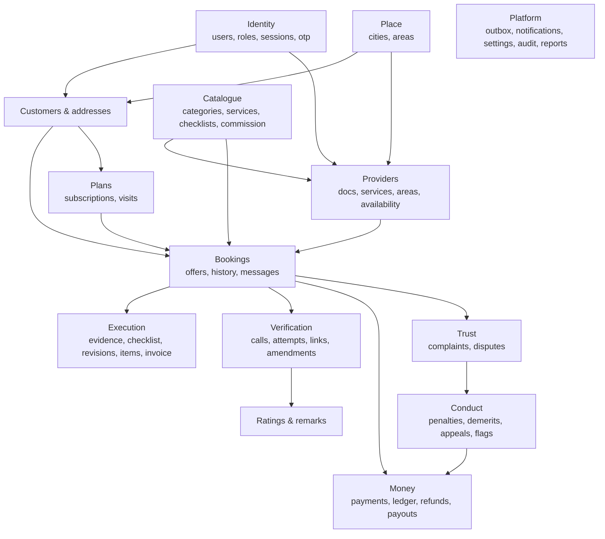
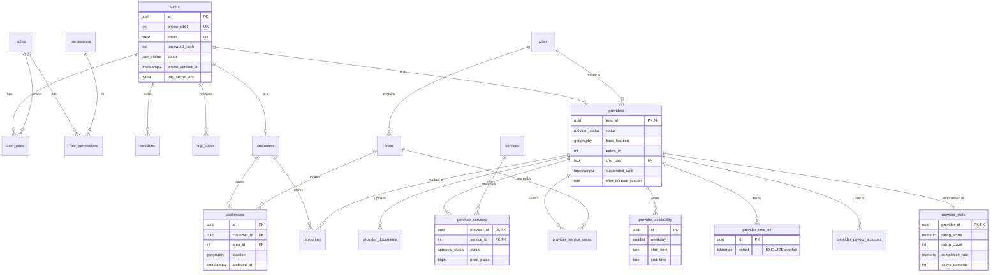
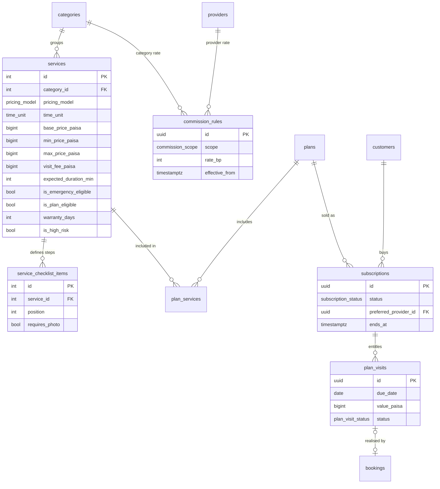
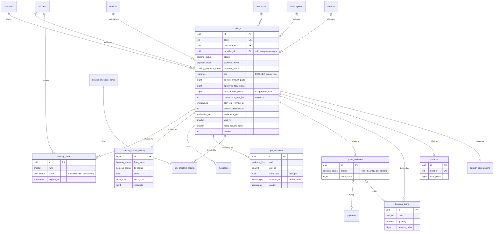
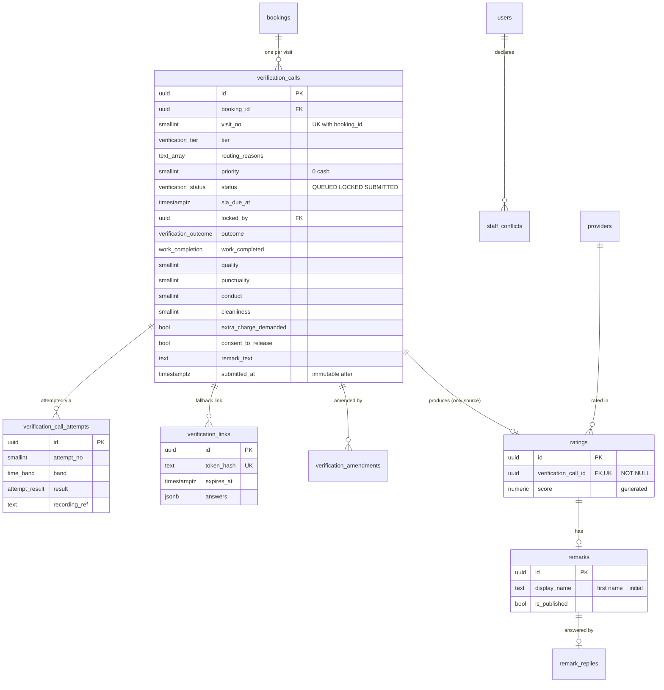
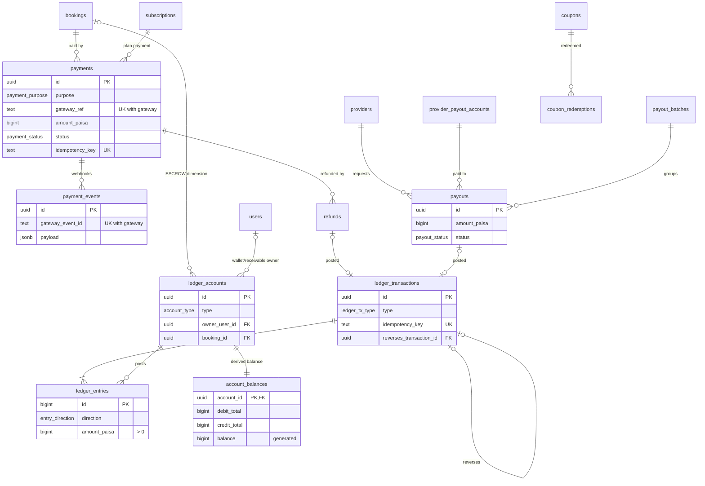
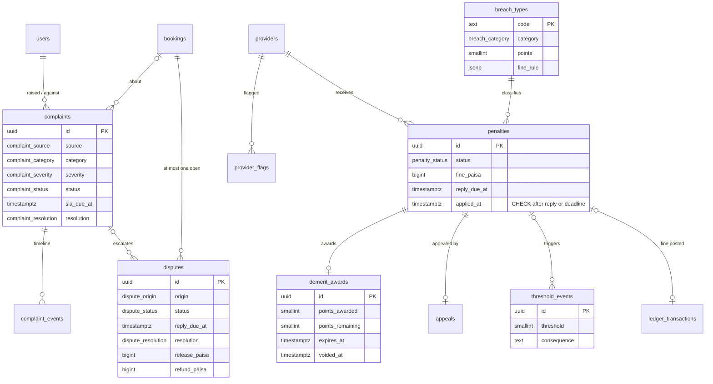
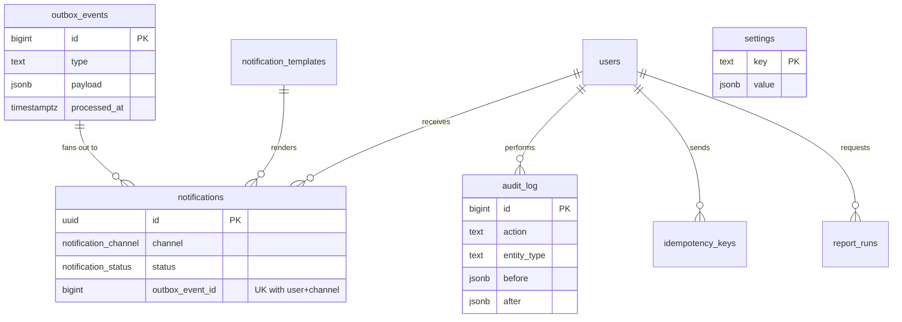

# Entity-Relationship Design (ERD) — Smart Home Maintenance Services

| Field | Detail |
|---|---|
| Version | 1.0 |
| Physical schema | `04_schema.sql` (PostgreSQL 16 + PostGIS) — **the source of truth**; this document explains it |
| Tables | 72 tables, 3 views, 52 enum types |

Diagrams are split by domain for readability (Mermaid renders on GitHub, GitLab, Cursor preview and most Markdown viewers). Only keys and the most significant columns are drawn; `04_schema.sql` has every column, type and constraint.

---

## 1. Domain Map

---

## 2. Identity, Place, Customers & Providers

---

## 3. Catalogue & Plans

---

## 4. Bookings & Execution

---

## 5. Verification & Reputation

---

## 6. Money

---

## 7. Trust & Conduct

---

## 8. Platform

---

## 9. Data Dictionary (by table)

Legend: **PK** primary key · **FK** foreign key · **UK** unique · 🔒 insert-only (DB trigger) · ⛔ no physical delete.

### Identity
| Table | Purpose | Key rules |
|---|---|---|
| `users` ⛔ | Every human account (customer, provider, staff). | Phone or email required; deactivation = `status` + anonymisation, never delete. |
| `roles`, `permissions`, `role_permissions`, `user_roles` | RBAC (FR-AD-13). A user may hold several roles (e.g. staff who is also a customer). | Permissions are codes checked by the API policy guard. |
| `sessions` | Refresh-token sessions with rotation families. | Reuse of a rotated token revokes the whole family. |
| `otp_codes` | Registration, login, reset, phone-change codes. | Hashed; 10-min expiry; 5 attempts. |

### Place & Catalogue
| Table | Purpose | Key rules |
|---|---|---|
| `cities`, `areas` | Structured location (FR-SR-04). | Launch = one city; schema multi-city ready. |
| `categories`, `services` | Catalogue (M1). | Price band check; `TIME_BASED` ⇔ `time_unit`; inspection-first ⇒ visit fee > 0. |
| `service_checklist_items` | Ordered completion steps (FR-EX-08). | `requires_photo` enforces evidence. |
| `commission_rules` | Global/category/provider rates in basis points. | Scope-consistency check; resolution done in code; snapshot on booking. |

### Customers & Providers
| Table | Purpose | Key rules |
|---|---|---|
| `customers`, `addresses`, `favourites` | Customer profile (M2). | Addresses archived, never deleted (bookings reference them); one default. |
| `providers` | Provider profile & lifecycle. | CNIC encrypted + blind index UK; `offer_blocked_reason` excludes from offers/search. |
| `provider_documents` | CNIC/cert uploads & review. | Approval blocked until CNIC `VERIFIED`. |
| `provider_services` | Approved expertise + own price (FR-CAT-03/04). | Price-band check in service layer. |
| `provider_service_areas` | Areas served (FR-SP-08). | Combined with radius in search. |
| `provider_availability`, `provider_time_off` | Weekly rules + leave (FR-SP-07). | Time-off ranges cannot overlap (exclusion). |
| `provider_payout_accounts` | Bank/wallet destinations. | Number encrypted; last4 for display. |
| `provider_stats` | Read-model projection for search & dashboards. | Written only by the projections worker. |

### Bookings & Execution
| Table | Purpose | Key rules |
|---|---|---|
| `bookings` ⛔ | The job and its state. | Status changes only via service (trigger); exclusion constraint prevents double booking; `final ≤ approved_total`; post-start states require OTP; release requires verification or dispute resolution (trigger). |
| `booking_offers` | Offer cascade / auto-assign (CL-05). | One pending offer per booking. |
| `booking_status_history` 🔒 | Full transition log (FR-BK-08). | One row per transition. |
| `messages` | Masked in-app chat (FR-BK-07). | No phone numbers exposed. |
| `job_evidence` 🔒 | Photos for problem/before/after/checklist/complaint. | `(booking_id, client_uuid)` UK for offline retry dedupe; server `received_at` authoritative. |
| `job_checklist_results` | Checklist completion per visit. | |
| `quote_revisions` | On-site revised quotes (FR-EX-05). | One pending per booking; top-up payment link. |
| `booking_items` | Invoice lines (service, visit fee, extra, part, surcharge, discount). | Only discounts negative. |
| `invoices` | Issued invoice at completion. | Total arithmetic check. |
| `coupons`, `coupon_redemptions` | Promotions funded from commission (FR-PY-10). | One redemption per booking. |

### Verification & Reputation
| Table | Purpose | Key rules |
|---|---|---|
| `verification_calls` | The verification record (one per completed visit). | Immutable once submitted (trigger); questionnaire completeness and integrity guards as CHECKs; queue index on `(priority, sla_due_at)`. **Deviation from v2.0:** unique on `(booking_id, visit_no)` rather than `booking_id`, because a rework produces a second visit that must be verified while the first record stays immutable. |
| `verification_call_attempts` 🔒 | Each call attempt (FR-VC-06). | |
| `verification_links` | Tier B / fallback one-tap confirmations (v2.0 name: `verification_responses`). | Token and OTP hashed. |
| `verification_amendments` 🔒 | Linked corrections (FR-VC-08). | |
| `staff_conflicts` | Declared conflicts (CL-19). | Also checked: same phone/email/CNIC. |
| `ratings` 🔒 | Published score inputs. | **FK + NOT NULL + trigger** to a rating-producing verification — the single rule that makes every rating trustworthy. |
| `remarks`, `remark_replies` 🔒(replies) | Public remark + one provider reply. | Unpublish keeps rating in score. |

### Money
| Table | Purpose | Key rules |
|---|---|---|
| `payments` | Gateway checkouts (booking, top-up, plan, debt). | Idempotency key UK; `(gateway, gateway_ref)` UK. |
| `payment_events` | Raw webhooks. | `(gateway, gateway_event_id)` UK → replay-safe. |
| `ledger_accounts` | Chart of accounts with owner/booking/subscription dimensions. | `UNIQUE NULLS NOT DISTINCT`. |
| `ledger_transactions` 🔒 | One business posting. | Idempotency key UK; reversals link to original. |
| `ledger_entries` 🔒 | Debit/credit lines. | Deferred trigger: Σ debit = Σ credit, ≥ 2 lines. |
| `account_balances` | Derived balances. | Maintained only by trigger; nightly reconciliation. |
| `refunds` | Refunds to original method. | Linked ledger transaction. |
| `payout_batches`, `payouts` | Provider payouts (FR-PY-08). | |

### Trust & Conduct
| Table | Purpose | Key rules |
|---|---|---|
| `complaints`, `complaint_events` 🔒 | Complaint lifecycle (M10). | Resolved ⇔ `resolved_at`. |
| `disputes` | Money disputes (UC-14). | One open per booking; resolved ⇔ resolution. |
| `breach_types` | Demerit schedule (SRS §8.2), seeded. | Category drives CL-14. |
| `penalties` | Proposed/applied/appealed penalties. | CHECK: applied only after reply or deadline (FR-PN-06). |
| `demerit_awards` | Points with remaining/expiry for decay (CL-15). | Voided on successful appeal. |
| `threshold_events` | Consequences fired on crossings (CL-16). | |
| `appeals` | One appeal per penalty. | |
| `provider_flags` | Issue/low-rating/cancellation/anomaly flags. | 3 in 90 days → review. |

### Platform
| Table | Purpose | Key rules |
|---|---|---|
| `outbox_events` | Transactional outbox. | Processed with `SKIP LOCKED`. |
| `notifications`, `notification_templates` | Delivery log + editable templates (M11). | `(outbox_event_id, user_id, channel)` UK for idempotent fan-out. |
| `idempotency_keys` | Client idempotency for mutations. | |
| `settings` | All configurable values (SRS §13). | Changes audited. |
| `audit_log` 🔒 | Privileged actions (FR-AD-14). | |
| `report_runs` | Async report generation (M14). | |

### Views
`v_provider_wallet` (wallet balance per provider), `v_escrow_by_booking` (held per booking), `v_active_demerits` (active points per provider).

---

## 10. Cardinality & Lifecycle Notes
- **Customer 1 — N Bookings; Provider 0..1 — N Bookings** (null during auto-assign).
- **Booking 1 — N Verification records** (one per visit; normally 1, rework adds more). **Verification 1 — 0..1 Rating** (none for rework/dispute/auto-release).
- **Booking 1 — 0..1 Escrow account**, created lazily on first capture.
- **Provider 1 — 1 Wallet account**, created at approval.
- **Penalty 1 — 0..1 Demerit award**, **0..1 Appeal**, **0..1 Fine posting**.
- Soft-delete tables: `users` (status), `addresses` (`archived_at`), `provider_payout_accounts` (`archived_at`), catalogue (`is_active`).

## 11. Index Summary (NFR-PE-02)
City/area (`providers_city_idx`, `areas_city_idx`, `addresses.area_id`), service (`provider_services_service_idx`, `bookings_service_idx`), booking status (`bookings_status_idx`), rating (`provider_stats_rating_idx`), geography GiST (`providers_location_gix`, `addresses_location_gix`), queue (`verification_queue_idx`), outbox (`outbox_unprocessed_idx`), audit (`audit_log_entity_idx`, `audit_log_actor_idx`).

## 12. Prisma Integration
1. `dbmate up` applies `04_schema.sql` (copied to `packages/db/migrations/0001_init.sql`).
2. `prisma db pull` introspects; `geography` and `tstzrange` columns appear as `Unsupported(...)` — read/write them with `$queryRaw` in dedicated repository functions (`SlotRepository`, `GeoRepository`).
3. `prisma generate` produces the typed client. **Never** run `prisma migrate`; all schema changes are new dbmate SQL files followed by `db pull`.
4. Money columns are `BigInt` in Prisma — convert with the shared `Money` helper; never `Number()` on paisa values above 2^53 (not reachable in practice, but enforced by lint).
